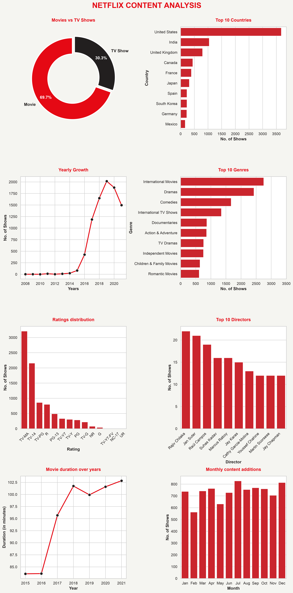

# 🎬 Netflix Content Analysis — Python


## 📌 Project Overview

Exploratory Data Analysis (EDA) of Netflix's content library using Python. Analyzed 8800+ titles across movies and TV shows to uncover content trends, top producing countries, popular genres, and growth patterns.

---

## 🎯 Business Problem

> *"Netflix wants to understand their content library — what types of content dominate, which countries produce most, how the library has grown, and what content strategy should be followed going forward."*

**Questions Answered:**
```
Q1.  Movies vs TV Shows — which dominates?
Q2.  Which countries produce most content?
Q3.  How has Netflix library grown year by year?
Q4.  What are the most common genres?
Q5.  Which age ratings dominate?
Q6.  Which directors have most content?
Q7.  What is average movie duration?
Q8.  Which month has most content added?
Q9.  Are movies getting shorter over time?
Q10. What should Netflix produce more of?
```

---

## 📁 Project Structure

```
netflix-analysis-python/
│
├── 📁 data/
│   └── netflix_titles.csv        # Raw dataset from Kaggle
│
├── 📁 notebooks/
│   └── netflix_analysis.ipynb    # Full analysis notebook
│
├── 📁 charts/
│   └── netflix_analysis.png      # All 8 charts combined
│
└── 📄 README.md
```

---

## 📊 Dataset

| Field | Details |
|-------|---------|
| Source | [Kaggle — Netflix Movies and TV Shows](https://www.kaggle.com/datasets/shivamb/netflix-shows) |
| Rows | 8,807 titles |
| Columns | 12 |
| Period | 2008 — 2021 |

**Key Columns:**
```
type         → Movie or TV Show
title        → Content name
director     → Director name
country      → Production country
date_added   → When added to Netflix
release_year → Year of release
rating       → Age rating (TV-MA, PG-13 etc)
duration     → Minutes or Seasons
listed_in    → Genre tags
```

---

## 🧹 Data Cleaning Steps

```python
1. Converted date_added → datetime
2. Extracted year_added, month_added, month_name
3. Filled nulls:
   - director  → 'Unknown'
   - cast       → 'Unknown'
   - country    → 'Unknown'
   - rating     → mode value
4. Dropped rows with null date/duration (13 rows)
5. Extracted duration as integer (duration_int)
6. Split into df_movies and df_shows
```

**After cleaning:**
```
Total rows  : 8,794
Movies      : 6,128
TV Shows    : 2,666
Null values : 0
```

---

## 📈 Key Findings

### 1. Content Type
```
🎬 Movies  → 69.7% of library
📺 TV Shows → 30.3% of library
→ Netflix is primarily a movie platform!
```

### 2. Top Producing Countries
```
🇺🇸 United States → 3,680 titles (#1 by far!)
🇮🇳 India         → 1,046 titles (#2)
🇬🇧 United Kingdom →  803 titles (#3)
→ Indian content is Netflix's 2nd biggest market!
```

### 3. Library Growth
```
📈 Explosive growth from 2015 → 2019
🏆 Peak year = 2019 (2,016 titles added)
📉 2020-2021 drop = likely COVID impact
   on content production worldwide
```

### 4. Top Genres
```
🌍 International Movies → 2,752 (#1)
🎭 Dramas              → 2,427 (#2)
😄 Comedies            → 1,674 (#3)
→ Netflix heavily invested in global content!
```

### 5. Age Ratings
```
🔞 TV-MA → 3,209 (36.5%) — dominates!
📺 TV-14 → 2,157 (24.5%)
→ Netflix targets adult audience primarily
```

### 6. Top Directors
```
🏆 Rajiv Chilaka    → 22 titles (children's content)
2️⃣ Jan Suter        → 21 titles
3️⃣ Raúl Campos      → 19 titles
→ Indian + Latin American directors lead!
```

### 7. Movie Duration
```
⏱️ Average duration = 99.57 minutes (~1hr 40min)
📈 Movies getting LONGER not shorter!
   2015: ~84 mins → 2021: ~103 mins
```

### 8. Monthly Additions
```
📅 Peak months = July, August, December
   Netflix drops most content in summer + holidays!
   Strategy: subscribe before July! 😄
```

---

## 💡 Business Recommendations

Based on the analysis:

```
1. PRODUCE MORE INTERNATIONAL CONTENT
   → International Movies = #1 genre
   → India + UK = top 2 non-US producers
   → Huge opportunity in regional languages

2. INVEST IN INDIAN MARKET
   → India = #2 content producer
   → Bollywood + regional content growing fast

3. FOCUS ON ADULT DRAMAS
   → TV-MA + Dramas = most common combination
   → Target 25-40 age group

4. INCREASE TV SHOW PRODUCTION
   → Only 30% of library
   → TV Shows drive longer engagement/retention

5. CONTENT DROP STRATEGY
   → July + December = peak addition months
   → Run subscription promotions in June + November
      (just before peak content months!)
```

---

## 📊 Visualizations



*All 8 charts in Netflix red theme — Movies vs TV Shows, Top Countries, Yearly Growth, Top Genres, Ratings Distribution, Top Directors, Movie Duration Trend, Monthly Additions*

---

## 🛠️ Tools & Libraries

| Tool | Purpose |
|------|---------|
| Python 3 | Core language |
| Pandas | Data manipulation |
| NumPy | Numerical operations |
| Matplotlib | Base plotting |
| Seaborn | Statistical visualizations |
| Google Colab | Development environment |

---

## 🚀 How to Run

1. Clone this repository:
```bash
git clone https://github.com/harshi1006/netflix-analysis-python.git
```

2. Install dependencies:
```bash
pip install pandas numpy matplotlib seaborn
```

3. Download dataset from Kaggle:
```
https://www.kaggle.com/datasets/shivamb/netflix-shows
```

4. Place `netflix_titles.csv` in `/data/` folder

5. Open `notebooks/netflix_analysis.ipynb` in Jupyter or Colab

6. Run all cells!

---

## 👩‍💻 Author

**Harshii**
- 🔗 GitHub: [harshi1006](https://github.com/harshi1006)
- 💼 Role: Data Analyst | TCS
- 📍 Indore, India

---

## 📄 License

This project is open source and available under the MIT License.
